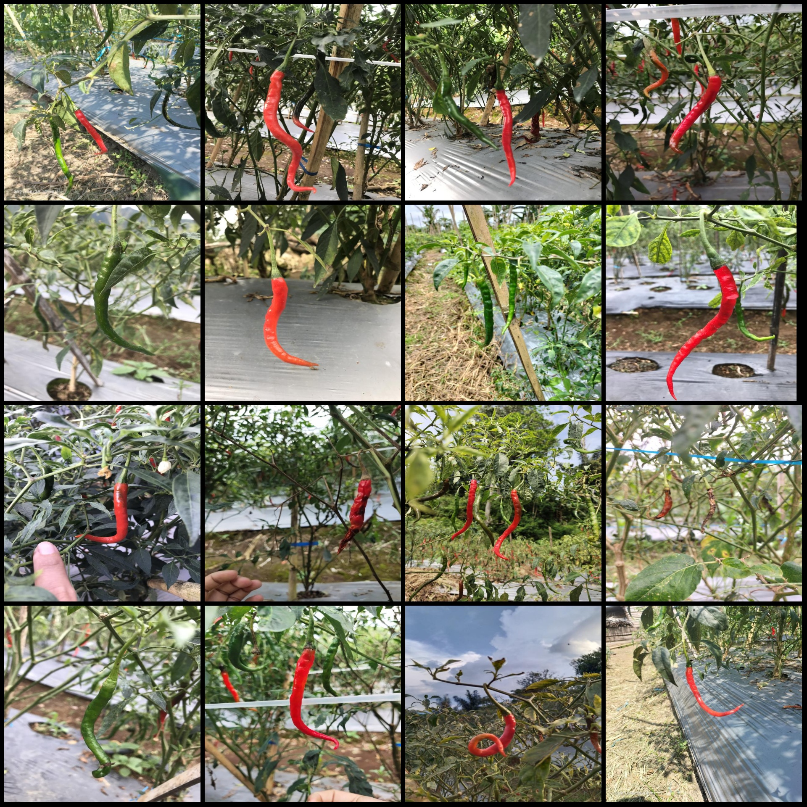
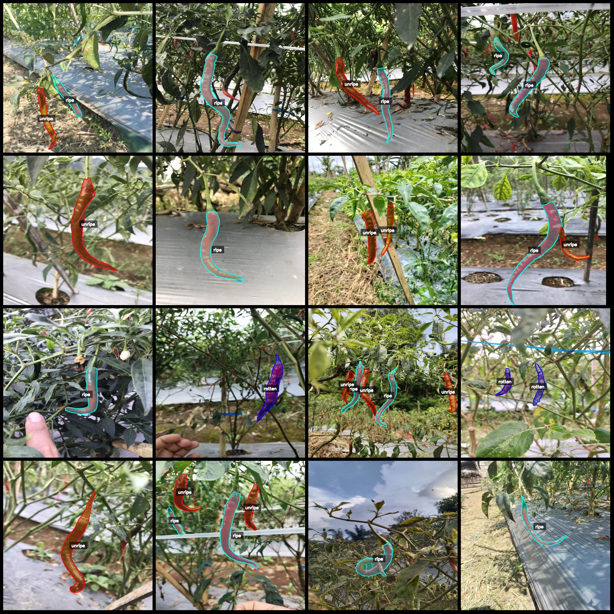
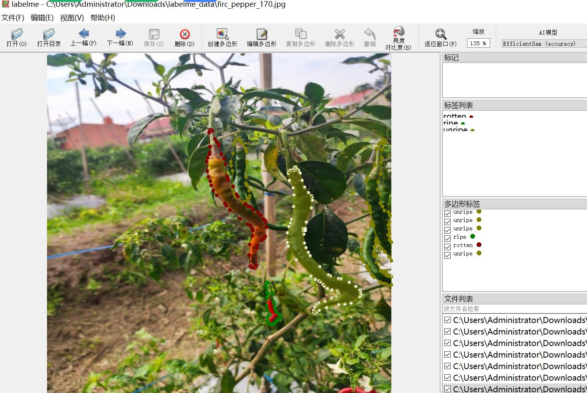

# Intelligent Agriculture Pepper and Chili Maturity Detection Dataset: LabelMe Format, 1257 Images in 3 Classes

The dataset format is as follows: LabelMe format (excluding mask files, only including JPG images and corresponding JSON files).  
Number of images (JPG file counts): 1257  
Number of annotations (JSON file counts): 1257  
Number of annotation categories: 3  
Annotation category names: ["rotten", "ripe", "unripe"]  
Box counts for each category:  
rotten (rotten count = 374)  
ripe (ripe count = 827)  
unripe (unripe count = 843)  
Total boxes: 2044  
Annotation tool used: labelme=5.5.0  
Image resolution: 640x640  
Annotation rules: Polygons are drawn around the categories.  
Important Notice: The dataset can be opened and edited using LabelMe, but the JSON dataset requires conversion to either mask or Yolo or COCO format for semantic segmentation or instance 
segmentation.  
Special Notice: This dataset does not guarantee the accuracy of the trained models or weight files.  
Image preview:  
Annotation examples:  
Randomly selected 16 images for annotation:  
Annotation drawing results:  
LabelMe editing image example:

## Images

Here is a pay link on Stripe ( https://buy.stripe.com/3cs8yP7sY87d0vu9AB ). Please contact me lonlonago@foxmail.com after funding $89, and I will send you a complete data files , thank you!

